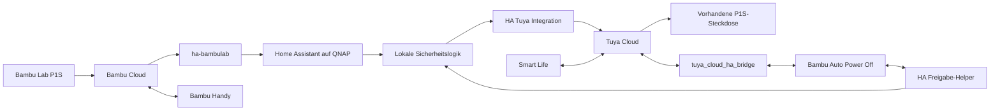

# Bambu Smart Life Auto Power Off

Automatische One-Shot-Abschaltung eines Bambu Lab P1S über eine vorhandene
Tuya-Steckdose. Home Assistant läuft auf dem QNAP NAS; Bambu Cloud und Handy-App
bleiben nutzbar. In Smart Life erscheint zusätzlich **Bambu Auto Power Off**.

**Im Zweifel bleibt die Steckdose eingeschaltet.** Vor der Inbetriebnahme müssen
die tatsächlichen Entity-IDs und die Tuya-Bridge zugeordnet werden. Die mitgelieferten
Platzhalter können keine Abschaltung auslösen. Es wurden keine Zugangsdaten angelegt.

## Überblick und Architektur



Die Bridge exportiert den Freigabeschalter nach Smart Life. Die offizielle
Tuya-Integration importiert die reale Steckdose nach HA. Die Abschaltung erfolgt
in HA, damit alle Prüfungen und der One-Shot-Reset zusammenbleiben. Eine zusätzliche
Smart-Life-Abschaltautomation ist nicht erforderlich.

Die kleine lokale Integration `p1s_guard` ergänzt Zustandsprüfung und Abschaltung.
Sie implementiert **keine Bambu- oder Tuya-MQTT-Bridge**. Ihre Notwendigkeit gegenüber
einer reinen Template-Lösung: Bridge-Verbindungsstatus abfragen, frische Berichte
nach Neustart verlangen, direkt vor dem Schaltaufruf erneut prüfen und einen
normalen HA-Geräteeintrag für den virtuellen Switch bereitstellen. Die aktuelle
Tuya-Bridge ermittelt exportierbare Geräte über die HA-Geräteregistrierung;
ein geräteloser Template-Helper allein reicht dafür nicht zuverlässig aus.

## Voraussetzungen

- QNAP mit Container Station, Docker Compose v2 und einer vom HA-Image unterstützten
  64-Bit-CPU (amd64 oder arm64). Alte 32-Bit-NAS sind nicht vorgesehen.
- Python 3 auf dem NAS oder einem Rechner zur einmaligen Vorbereitung; HACS ist optional.
- Bambu-Konto mit zugeordnetem P1S und aktiviertem Cloud-Modus.
- Smart-Life-Konto mit der vorhandenen, in HA als `switch` unterstützten Steckdose.
- Tuya-API-Key für die Bridge, kompatible App und ausgehender Internetzugang.

## QNAP Installation und Docker Compose

Ausführlich: [QNAP-Installation](docs/setup-qnap.md).

Im Projektordner auf dem NAS:

```sh
cp .env.example .env
chmod 600 .env
python3 scripts/prepare.py
python3 scripts/install_integrations.py
docker compose config --quiet
docker compose up -d
```

Vor dem Start `HA_BIND_IP` in `.env` auf die **LAN-IP des NAS** setzen. Der sichere
Standard `127.0.0.1` erlaubt zunächst nur Zugriff vom NAS selbst. Danach HA unter
`http://QNAP-IP:8123` öffnen. Keine WAN-Portfreigabe einrichten.

Der Installationshelfer installiert `ha-bambulab v2.2.26` und Tuya Bridge `v1.1.2`
aus festen Downloads mit SHA-256-Prüfung. Quellen/Prüfsummen stehen in
`integrations.lock.json`. Bestehende Installationen werden nicht überschrieben.
Alternativ diese Versionen über HACS installieren. Keine Integration doppelt installieren.

`./runtime/homeassistant` ist das persistente `/config`. Versionierte YAML-Dateien
und die lokale Guard-Komponente werden gezielt schreibgeschützt eingebunden.
UI-Automationen und externe Integrationen liegen im beschreibbaren Laufzeitordner.
Ein alternativer QNAP-Pfad wie `/share/Container/bambu-homeassistant/config` wird
über `HA_CONFIG_DIR` konfiguriert; beide Vorbereitungsskripte dann mit
`--config-dir /share/Container/bambu-homeassistant/config` ausführen.

Bridge-Netzwerk genügt für die Cloud-Verbindungen. Es gibt kein Host-Netzwerk,
kein `privileged`, keine zusätzlichen Capabilities und keinen Docker-Socket-Mount.
Lokale automatische Geräteerkennung ist für diesen Cloud-Aufbau nicht nötig.
Container Station zeigt die gestartete Compose-Anwendung an.

## Home Assistant Setup

1. Lokales Administratorkonto im HA-Onboarding anlegen.
2. Bambu- und Tuya-Integrationen einrichten, siehe unten.
3. In **Entwicklerwerkzeuge → Zustände** die Entity-Zuordnung prüfen.
4. `.env` ergänzen und `docker compose up -d --force-recreate` ausführen.
5. Die Freigabe zunächst ausgeschaltet lassen und die Abnahmetests durchführen.

Der Guard wird aus YAML automatisch eingerichtet. Seine sichtbaren Entities sind:

| Entity | Aufgabe |
|---|---|
| `input_boolean.bambu_auto_power_off` | Gespeicherte Freigabe |
| `switch.bambu_auto_power_off` | Geräteschalter für Smart Life, identischer Zustand |
| `binary_sensor.p1s_safe_power_off` | Erst nach vollständig stabiler Prüfung `on` |
| `input_boolean.p1s_power_off_fault` | Gespeicherte Sperre bei unbestätigtem Versuch |
| `input_boolean.p1s_power_off_notifications` | Optionale lokale Erfolgsmeldung |

Diese IDs nicht umbenennen. Bei einer bereits vorhandenen gleichnamigen Entity
zuerst den Namenskonflikt lösen; das Paket ist für eine neue HA-Instanz ausgelegt.
Der Safe-Sensor zeigt in seinen Attributen die aktuelle Phase und die zugeordneten IDs.

## ha-bambulab Setup

Unter **Einstellungen → Geräte & Dienste → Integration hinzufügen → Bambu Lab**
den Cloud-Anmeldeweg verwenden. Bambu-Konto, passende Kontoregion und gegebenenfalls
E-Mail-Verifizierung/2FA im Dialog eingeben. P1S auswählen und die Cloud-Verbindung
verwenden. LAN Only Mode und Developer Mode sind nicht erforderlich.
Nur die Status-/Temperatur-Entities werden von dieser Lösung gelesen;
keine Drucker-Steueraktionen oder eigene MQTT-Kommandos werden aufgerufen.
Kamera, FTP und lokale Steuerfunktionen sind für die Abschaltung nicht erforderlich.

Der geprüfte Quellcode von `ha-bambulab v2.2.26` gibt den Druckstatus mit
`gcode_state.lower()` aus, bei Offlinezustand als `offline`. Erfolg ist deshalb
**`finish`**, nicht `FINISH`, `completed` oder ein übersetzter UI-Text.
Nach einem realen erfolgreichen Druck diesen Rohwert in Entwicklerwerkzeuge prüfen.
Der Online-Binary-Sensor hat den Rohzustand `on`. Diagnose-Entities gegebenenfalls
in den Entity-Einstellungen aktivieren. Tatsächliche IDs hängen von Drucker,
Seriennummer, Sprache und bisherigen Umbenennungen ab.

## Tuya Setup und Smart Life Setup

Siehe [Tuya und Smart Life](docs/setup-tuya.md) für Anmeldung und QR-Kopplung.
Die vorhandene Steckdose wird über **HA → Tuya** eingebunden. Die separate
**Tuya Cloud HA Bridge** erzeugt ein virtuelles Gateway. Nach QR-Kopplung mit
Smart Life dort das Gerät **Bambu Auto Power Off** hinzufügen.

Nur diesen Freigabeschalter exportieren. Die reale Steckdose bleibt ihr bereits
vorhandenes Smart-Life-Gerät. Ein Schalten der Freigabe darf die Steckdose niemals
direkt schalten. HA → Smart Life und Smart Life → HA separat testen.

## Entity-Zuordnung und Parameter

Alle Werte werden in `.env` eingetragen und von Compose als ENV an HA übergeben.
`guard.yaml` liest sie mit `!env_var`. Änderungen erfordern Container-Neuerstellung;
ein bloßes Neustarten übernimmt geänderte Compose-ENV nicht.

| ENV | Zuordnung / Standard |
|---|---|
| `P1S_STATUS_ENTITY` | Print status: Rohwert `finish` |
| `P1S_NOZZLE_ENTITY` | Gemessene Düsentemperatur, °C |
| `P1S_NOZZLE_TARGET_ENTITY` | Düsen-Solltemperatur, °C |
| `P1S_BED_ENTITY` | Gemessene Betttemperatur, °C |
| `P1S_BED_TARGET_ENTITY` | Bett-Solltemperatur, °C |
| `P1S_PROGRESS_ENTITY` | Druckfortschritt, 0–100 |
| `P1S_ONLINE_ENTITY` | Bambu Online-Binary-Sensor |
| `P1S_PLUG_ENTITY` | **Reale** Tuya-Steckdose, Domain `switch` |
| `TUYA_BRIDGE_ENTRY_ID` | HA-Konfigurationseintrag der Bridge, kein Tuya-Geräte-ID |
| `SAFE_NOZZLE_TEMPERATURE` | 50 °C; konservativ auf 1–50 einstellbar |
| `STABLE_SECONDS` | 30; nur 30–3600 zulässig |
| `MAX_DATA_AGE_SECONDS` | 60; 5–120 zulässig |
| `POWER_OFF_TIMEOUT_SECONDS` | 20; 5–120 zulässig |

Die Bridge-Eintrag-ID in HA unter der geöffneten Integrationsseite aus der URL
`/config/integrations/integration/tuya_cloud_ha_bridge` beziehungsweise dem Link
zum konkreten Konfigurationseintrag ermitteln. Zuverlässiger: In **Entwicklerwerkzeuge
→ Template** `{{ config_entry_id('ENTITY_DER_BRIDGE') }}` für eine tatsächlich der
Bridge zugeordnete Entity auswerten. Falls keine solche Entity vorhanden ist,
die ID lokal aus `/config/.storage/core.config_entries` beim Eintrag mit
`domain: tuya_cloud_ha_bridge` ablesen. Diese Datei enthält Secrets: **nicht posten**.

Jeden `replace_with_...`-Platzhalter aus `.env.example` ersetzen. Nicht die
Beispielnamen als echte Entity-Namen übernehmen. Keine Passwort-ENV erfinden:
die Cloud-Integrationen unterstützen keine allgemeine YAML/ENV-Anmeldung.

## Auto Power Off Logik

Freigabe → erfolgreicher Druck → Abkühlen → Stabilisierung → Abschaltversuch → Reset.
Zusätzlich zu den gewünschten Bedingungen werden Onlinezustand, Bridge-Verbindung,
100 % Fortschritt, gültige Betttemperatur und aktuelle Telemetrie verlangt.
Die gemessene Betttemperatur wird auf Gültigkeit geprüft, hat aber keine zusätzliche
Abkühlgrenze. Die Steckdose muss `on` sein. Unbekannte, fehlende, negative,
nicht endliche oder nicht in °C gelieferte Temperaturwerte blockieren.

Die Freigabe darf auch bei bereits vorhandenem `finish` aktiviert werden. Dann
beginnt trotzdem eine neue vollständige Wartezeit. Ein unsicherer Zustand setzt
sie zurück. Der Guard reagiert auf Sensoränderungen und prüft zusätzlich jede
Sekunde. Ein Aussetzer seiner Ereignisschleife über drei Sekunden startet die
Beobachtung neu.

Nach Neustart bleibt die Freigabe gespeichert. Der Timer wird nie wiederhergestellt;
es werden neue Druckerberichte nach Guard-Start verlangt. Bei 80 °C wird weiter
gewartet. Steckdosen melden oft nur Änderungen; für deren `on`-Zustand gibt es
deshalb keine identische Altersgrenze. Vor dem Versuch wird Verfügbarkeit geprüft,
danach ein neuer `off`-Zustand verlangt.

Vor dem Schaltaufruf wird eine Fehlersperre gespeichert und nochmals geprüft.
Nur nach erfolgreichem Dienstaufruf **und** neu gemeldetem `off` werden Freigabe
und Sperre ausgeschaltet. Bei Fehler/Timeout kein Reset und kein automatischer
Wiederholungsversuch. Steckdose prüfen, Freigabe ausschalten, dann unter
**Entwicklerwerkzeuge → Aktionen → `p1s_guard.acknowledge_fault`** bestätigen.
Anschließend bei Bedarf erneut freigeben. Nach Absturz während eines Versuchs
kann ebenfalls diese Bestätigung nötig sein.

Erfolgsmeldungen sind standardmäßig deaktiviert. Fehlermeldungen erscheinen lokal.
Phasenwechsel und bestätigte Abschaltung stehen im HA-Log, ohne Zugangsdaten.

## Tests

[Testmatrix und lokale Ergebnisse](docs/tests.md) enthält die zehn geforderten
Fälle sowie Ausfall-, Neustart-, Bestätigungs- und Parallelitätsprüfungen.

```sh
python3 -m pip install -r requirements-test.txt
python3 -m unittest discover -s tests -v
docker compose config --quiet
docker compose run --rm --no-deps --entrypoint python homeassistant \
  -m homeassistant --script check_config --config /config
```

Die letzte Prüfung benötigt einen laufenden Docker-Dienst. Ein GitHub-Actions-
Workflow enthält dieselben Prüfungen mit `.env.example`, ohne private Konten.
Eine Beispiel-Dashboard-Karte kann als Entities-Karte die fünf oben genannten
lokalen Entities und die acht eigenen Drucker-/Steckdosen-Entities anzeigen.
Für eine Phase-Anzeige den Safe-Sensor öffnen.

## Sicherheit

`.env`, der gesamte Laufzeitordner, `.storage/`, Datenbanken, Logs und Backups
sind vom Git ausgeschlossen. Bambu-Anmeldedaten, Tuya-Anmeldung, Bridge-API-Key
und erzeugte Gateway-Credentials werden ausschließlich in den offiziellen
HA-Dialogen eingegeben und lokal unter `/config/.storage` gespeichert. Diese
lokale Speicherung ist ausdrücklich vorgesehen. Kein `secrets.yaml` erforderlich.

`/config` und `.env` über QNAP-Dateirechte/ACL nur Administratoren zugänglich machen.
Auch verschlüsselte oder geschützte Backups sind vertraulich. Vor einem Commit
`git status --short` und den Diff prüfen; `.gitignore` schützt nicht vor `git add -f`.
Bei versehentlicher Veröffentlichung Credentials sofort widerrufen/rotieren.
Kein WAN-Zugriff auf Port 8123; LAN-Zugriff per NAS-Firewall auf das eigene Netz
begrenzen. Debug-Logging der Cloud-Integrationen nicht dauerhaft aktivieren.

Das ist eine konservative Komfortautomatik, keine unabhängige Hardware-Sicherung.
Cloud-Ausfälle werden erst durch die Integrationen bzw. die Telemetrie-Altersgrenze
erkennbar. `last_reported` ist ein HA-Berichtszeitpunkt, kein garantiert unabhängiger
Drucker-Zeitstempel. Auch ein in HA gemeldetes `off` ist keine elektrische Messung.
Eine zwischen letzter Prüfung und Cloud-Ausführung beginnende neue Druckaktion
kann technisch nicht atomar ausgeschlossen werden. Während einer freigegebenen
Abschaltung keinen neuen Druck starten; vor neuen Druck-/Heizaktionen Freigabe aus.
Eine absolute Garantie „niemals versehentlich“ kann diese Cloud-Architektur nicht geben.

## Updates und Backup

Freigabe ausschalten und HA vor konsistenten Dateibackups stoppen:

```sh
docker compose stop homeassistant
# /config, .env, compose.yaml und versionierte Konfiguration separat sichern
docker compose pull
docker compose up -d
```

Gesamten Laufzeitordner inklusive `.storage` sichern, außerdem `.env`, Compose,
YAML und `integrations.lock.json`. Backups außerhalb des öffentlichen Repositories
aufbewahren. Restore bei gestopptem HA; Dateirechte wiederherstellen. Danach neu
validieren und die Tests zur Freigabe/Wartezeit durchführen.

Upstream-Integrationen bleiben zunächst auf den gesperrten Versionen. Bei Updates
Release-Notizen prüfen, Backup erstellen, Quellen/Prüfsummen in der Lockdatei
bewusst aktualisieren oder über HACS eine gewählte Version installieren.
Bridge-`runtime_data.connected` ist eine integrationsinterne Schnittstelle;
ändert sie sich, blockiert der Guard, bis der Adapter angepasst wurde.
HA verwendet den ausdrücklich erlaubten `stable`-Tag; für reproduzierbare
Produktivstände nach erfolgreicher Prüfung optional einen Image-Digest verwenden.

## Troubleshooting

Siehe [Fehlersuche](docs/troubleshooting.md). Die wichtigste Diagnose steht im
Attribut `phase` von `binary_sensor.p1s_safe_power_off`. Die Logik nicht durch
erfundene sichere Sensorwerte oder eine direkte Abschaltautomation umgehen.

## Quellen und Planprüfung

Dokumentation und Release-Quellen geprüft am 20.09.2026:

- [Home Assistant Container](https://www.home-assistant.io/installation/linux#install-home-assistant-container)
- [ha-bambulab Dokumentation](https://docs.page/greghesp/ha-bambulab)
- [Tatsächliche Bambu-Sensorwerte v2.2.26](https://github.com/greghesp/ha-bambulab/blob/v2.2.26/custom_components/bambu_lab/definitions.py)
- [HA Tuya: Smart-Life-Anmeldung](https://www.home-assistant.io/integrations/tuya/)
- [Tuya Bridge v1.1.2: Einrichtung und unterstützte Typen](https://github.com/tuya/tuya_cloud_ha_bridge/tree/v1.1.2)
- [Bridge TuyaLink-Verbindungsstatus](https://github.com/tuya/tuya_cloud_ha_bridge/blob/v1.1.2/custom_components/tuya_cloud_ha_bridge/tuya_link_mqtt.py)
- [QNAP Container Station 3](https://www.qnap.com/en-in/how-to/tutorial/article/how-to-use-container-station-3)

Abweichungen vom Ausgangsplan: `finish` statt `FINISH`; gerätegebundener
Proxy-Switch statt gerätelosem Template-Switch; zusätzliche Frische-/Fortschritts-
und Fehlersperren; lokale HA-Credentials statt nicht unterstützter ENV-Loginfelder.
