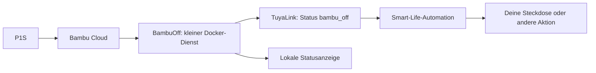

# BambuOff – Smart-Life-Auslöser ohne Home Assistant

Ein kleiner Docker-Dienst liest den Status deines **Bambu Lab P1S über die Bambu
Cloud**. Sobald der Druck erfolgreich fertig und die Düse abgekühlt ist, meldet
er **BambuOff = EIN** an ein eigenes TuyaLink-Gerät in Smart Life.

In Smart Life legst **du selbst** fest, was daraufhin passiert – beispielsweise
„Wenn BambuOff EIN wird → P1S-Steckdose ausschalten“. Die App kennt deine
Steckdose nicht und kann sie nicht direkt steuern.

**Stand:** eigenständige App mit lokalem Demo-Modus, Tests und TuyaLink-Anbindung
implementiert. Die Tuya-Dokumentation unterstützt diesen Aufbau. Die tatsächliche
QR-Kopplung, Verfügbarkeit des Auslösers in deinem Konto und Bambu-Livedaten müssen
noch mit deinen Geräten/Zugangsdaten geprüft werden. Es ist kein bereits
bereitgestelltes Smart-Life-Gerät und keine garantierte Ein-Klick-Einrichtung.

## Lokal auf Windows starten

Docker Desktop öffnen. In PowerShell:

```powershell
cd C:\Projects\bambu-smartlife-auto-poweroff
docker compose --env-file .env.example up -d --build
```

Dann **[http://localhost:8080](http://localhost:8080)** öffnen.

Das ist absichtlich **Demo-Modus**: simulierte Druckdaten, keine Cloud-Anmeldung,
keine echten Smart-Life-Auslöser. Ein Zyklus dauert standardmäßig 85 Sekunden:
Drucken → Abkühlen → 30 Sekunden stabile Werte → 30 Sekunden BambuOff EIN →
AUS trotz weiterhin abgeschlossenem Druck → nächster Druck.
Die Statusseite ist nur zur Kontrolle; deine eigentlichen Aktionen bleiben in Smart Life.

Die Anzeige nennt das **Abschaltsignal EIN/AUS** und erklärt die aktuelle Phase
auf Deutsch, beispielsweise „Warte auf erfolgreichen Druckabschluss“.
„Zuletzt von Tuya bestätigtes Abschaltsignal: AUS“ bedeutet, dass Tuya den
AUS-Wert bestätigt hat. Es ist kein Übertragungsfehler. Ohne Bestätigung steht
dort „Tuya: noch kein bestätigter Signalwert“.
Unter „Technische Details“ bleiben die Rohdaten verfügbar: `phase` ist der
Statuscode, `phase_label` seine Erklärung und `tuya_confirmed_bambu_off` der
zuletzt bestätigte Signalwert (`true`/`false`, ohne Bestätigung `null`).
Das bisherige API-Feld `cloud_report_confirmed` heißt jetzt `tuya_confirmed_bambu_off`.

```powershell
docker compose logs --tail=50 bambuoff
docker compose stop bambuoff
```

Zum Testen ohne Docker, mit Python 3.13 oder neuer:

```powershell
python -m pip install -r requirements.txt
python -m bambuoff
```

Python liest `.env` nicht automatisch. Ohne gesetzte Prozessvariablen startet es
im Demo-Modus. Docker Compose übernimmt `.env` automatisch beim normalen Start.

## Für echte Smart-Life-Automationen einrichten

1. **Zuerst [TuyaLink-Gerät einrichten](docs/smartlife.md).** Dort einen
   Boolean-Datenpunkt `bambu_off` als **Szenenbedingung** freigeben und das Gerät
   per QR-Code an Smart Life binden. Das benötigt ein Tuya-Entwicklerkonto.
2. Lokale Einstellungen vorbereiten; vorhandene `.env`-Werte bleiben erhalten:

   ```powershell
   python scripts/configure.py
   python scripts/bambu_login.py
   notepad .env
   ```

   Das interaktive Bambu-Login fragt Passwort und gegebenenfalls E-Mail-/2FA-Code
   verdeckt ab und speichert nur Token, MQTT-Benutzername und ausgewählten Drucker
   lokal in `.env`. Es wird nicht automatisch hier ausgeführt. Bei Änderungen
   an Bambu-Login/Anti-Bot-Verfahren kann eine Anpassung nötig sein; siehe
   [Verbindungsdetails](docs/connections.md).

3. `TUYA_DEVICE_ID`, `TUYA_DEVICE_SECRET` und den richtigen Tuya-MQTT-Endpunkt
   eintragen. Es sind die Zugangsdaten **des neuen BambuOff-Geräts**, nicht die
   deiner Steckdose. `MODE=live` setzen.

   **Wichtig: Im Tuya-Portal „Central Europe Data Center“ auswählen.**
   Die bisher getestete Smart-Life-Einrichtung funktioniert mit diesem
   Datenzentrum; mit dem **China Data Center hat sie nicht funktioniert**.
   Der Tuya-MQTT-Endpunkt muss zum gewählten Gerätedatenzentrum passen.

4. Normal mit deiner lokalen `.env` starten:

   ```powershell
   docker compose up -d --build --force-recreate
   ```

5. In Smart Life zunächst eine harmlose Testaktion konfigurieren und den
   Übergang nach einem beaufsichtigten Druck prüfen. Erst danach deine Steckdose
   als Aktion auswählen. **Automationen ohne nachträgliche Verzögerung verwenden.**

Ein späterer Start mit `--env-file .env.example` schaltet wieder auf Demo um.
Die vorhandene `.env` wird dabei nicht überschrieben.

## Architektur


```mermaid
flowchart LR
    P[P1S] --> BC[Bambu Cloud]
    BC --> A[BambuOff: kleiner Docker-Dienst]
    A --> T[TuyaLink: Status bambu_off]
    T --> SL[Smart-Life-Automation]
    SL --> S[Deine Steckdose oder andere Aktion]
    A --> UI[Lokale Statusanzeige]
```

Kein Home Assistant, MQTT-Broker, Datenbankserver oder Webframework erforderlich.
Einzige Python-Laufzeitabhängigkeit: `paho-mqtt`. Das Image basiert auf
`python:3.13-slim` und läuft mit einem Benutzer ohne Root-Rechte. Es benötigt
nur ausgehende TLS-Verbindungen. Port 8080 ist standardmäßig an PC-Loopback gebunden.

Die früher gewünschten HA-Integrationen brauchen die HA-Laufzeit. Für den jetzt
gewünschten kleinen Statusdienst gibt es stattdessen zwei schmale Adapter:
Bambu-Cloud-Report-Abonnement und dokumentiertes TuyaLink-Property-Reporting.
Es werden **keine Bambu-Steuerkommandos**, keine Steckdosenbefehle und keine
Smart-Life-Szenenänderungen gesendet. Kein LAN Only Mode/Developer Mode nötig.

## Wann wird BambuOff EIN?

Alle Bedingungen müssen mindestens 30 Sekunden beobachtet werden:

- Ein aktiver Druck (`RUNNING`, `PREPARE` oder `PAUSE`) wurde beobachtet und
  wechselte für dieselbe Job-ID auf `FINISH` – die steigende Abschlussflanke.
- Beide Cloud-Verbindungen stehen; Tuya hat die initiale AUS-Meldung bestätigt.
- Beobachteter Druckstatus **`FINISH`**, Fortschritt **100 %**,
  positive Cloud-Job-ID, gültige Ist-/Solltemperaturen.
- Düse höchstens **50 °C**, Düsen-Solltemperatur **0**, Bett-Solltemperatur **0**.
- Keine fehlenden oder ungültigen Pflichtwerte; die **Düsen-Isttemperatur**
  darf höchstens 60 Sekunden alt sein.
- Fortlaufende Druckerberichte: Nach mehr als 60 Sekunden ohne relevante
  Druckerdaten werden gespeicherte Werte und Abschlussflanke verworfen.

`FINISH` ist der rohe MQTT-Wert; die alte HA-Integration wandelte ihn zu `finish` um.
Die Ist-Betttemperatur muss gültig sein, hat aber keine zusätzliche Abkühlgrenze.
Unveränderte Statuswerte, Fortschritt, Job-ID, Heizungsziele und Bett-Isttemperatur
werden innerhalb einer ununterbrochenen Sitzung aus Teilmeldungen zusammengeführt.
Ein einmal empfangenes `FINISH` bleibt damit auch während einer langen Abkühlung
gültig; die tatsächliche Düsentemperatur muss weiterhin aktuell gemessen werden.
`age_seconds` zeigt das Alter der letzten Meldung dieses Felds, nicht automatisch
einen Fehler. `missing_fields` und `stale_fields` nennen konkret blockierende Felder.
Bei einer unsicheren Meldung beginnt die Wartezeit neu. Eine neue Job-ID verwirft
alte Teilwerte; ein neuer aktiver Status verwirft die bisherige Abschlussflanke.
Auch Pausen der Ereignisverarbeitung
über drei Sekunden führen zu neuer Datenerfassung und Wartezeit.

Jeder gemeldete Cloud-Druck wird vor Versand des EIN-Signals in einer kleinen
Zustandsdatei vermerkt. Nach Neustart/Reconnect wird zuerst AUS gemeldet und eine
neue Abschlussflanke samt Wartezeit verlangt. Ein bei Programmstart schon
abgeschlossener Druck löst deshalb nichts aus. Auch ein Neustart oder eine
Cloud-Unterbrechung während der Abkühlphase verwirft die ausstehende Flanke;
im Zweifel bleibt der Drucker an. Der zuletzt bereits signalisierte Druck wird **nicht
nochmals ausgelöst**, auch wenn eine Bestätigung verloren ging. Dadurch kann
bei einem Absturz unmittelbar vor Versand ein Auslöser ausfallen; ein
unbeabsichtigter Wiederholungsversuch wird vermieden.

Das EIN-Signal ist ein **Impuls von maximal 30 Sekunden** (`PULSE_SECONDS`).
Danach geht es automatisch auf AUS, selbst wenn der Druckstatus weiterhin
`FINISH` meldet. Erst eine neue beobachtete Abschlussflanke eines weiteren Drucks
kann nach erneuter Sicherheitsprüfung einen Impuls erzeugen. Bei neuem Druck,
unsicheren Daten oder Verbindungsabbruch wird es schon früher lokal AUS.
Eine Cloud-Trennung verhindert allerdings das Übermitteln dieses
AUS-Werts. **Smart Life kann während eines Ausfalls einen alten Wert anzeigen.**
Deshalb als Auslöser **den Zustandswechsel auf EIN** nutzen, nicht als dauerhaft
gültige Freigabe oder zeitverzögerte Abschaltung. Auch bereits ausgelöste
Smart-Life-Aktionen lassen sich durch einen späteren AUS-Wert nicht zurückrufen.

Die App verwendet keine MQTT-Retain-Nachrichten und spielt bei Reconnect keine
alten EIN-Meldungen erneut ab. Ohne neue, vollständige Druckerberichte bleibt
sie gesperrt. Cloud-Signale können keine atomare Sicherheitsverriegelung mit
dem Drucker bieten: während einer möglichen Abschaltung keine neue Heiz-/Druckaktion starten.

## Einstellungen

Alle Zugangsdaten werden über `.env` und Compose-ENV übergeben.

| Einstellung | Zweck / Standard |
|---|---|
| `MODE` | `demo` oder `live` |
| `BAMBU_REGION` | `global` oder `china` |
| `BAMBU_SERIAL` | P1S-Seriennummer |
| `BAMBU_USERNAME` | MQTT-Benutzername `u_…`, nicht E-Mail |
| `BAMBU_ACCESS_TOKEN` | Bambu-Cloud-Token, nicht LAN-Zugangscode |
| `TUYA_DEVICE_ID` / `TUYA_DEVICE_SECRET` | Neues TuyaLink-Gerät |
| `TUYA_MQTT_HOST` | Endpoint des Gerätedatenzentrums, Standard `m1.tuyaeu.com` |
| `TUYA_PROPERTY_CODE` | Exakter Tuya-Datenpunktcode, Standard `bambu_off` |
| `SAFE_NOZZLE_TEMPERATURE` | 50 °C, konfigurierbar 1–50 |
| `STABLE_SECONDS` | 30, konfigurierbar 30–3600 |
| `PULSE_SECONDS` | 30 Sekunden EIN-Impuls, konfigurierbar 1–120 |
| `MAX_DATA_AGE_SECONDS` | Maximales Alter der Düsen-Isttemperatur und maximale Sendepause: 60 s, konfigurierbar 5–120 |
| `BIND_IP` / `PORT` | Statusseite, Standard `127.0.0.1:8080` |

Es gibt keinen Freigabe-Helper und keine Steckdosen-Entity mehr. Die Freigabe
erfolgt durch Aktivieren/Deaktivieren deiner Automation in Smart Life. Die
Zustandsdatei enthält nur die Version und einen Hash aus Drucker-/Job-ID,
keine Credentials. Nicht löschen, um einen alten Druck erneut auszulösen.

## QNAP

Projektordner mit `Dockerfile`, `requirements.txt`, `bambuoff/`, `compose.yaml`
und deiner privaten `.env` auf das NAS übertragen. Container Station mit
Compose-Build-Unterstützung beziehungsweise Docker Compose v2 verwenden:

```sh
docker compose up -d --build
```

Nach Änderungen an Code oder Konfiguration das Image neu bauen und den Container
explizit neu erstellen:

```sh
docker compose up -d --build --force-recreate
```

`BIND_IP` bei Bedarf auf die LAN-IP des NAS setzen. Keine WAN-Portfreigabe nötig.
Docker legt ein eigenes benanntes Volume für die kleine Zustandsdatei an.
Der Container ist auf 128 MiB RAM (ohne zusätzlichen Swap), 0,5 CPU-Kerne
und 64 Prozesse/Threads begrenzt. Die Statusseite verarbeitet höchstens acht
Verbindungen gleichzeitig; weitere Verbindungen werden geschlossen. Nach zwei
Sekunden ohne Socket-Fortschritt oder spätestens fünf Sekunden Gesamtdauer
wird eine Verbindung beendet, auch bei langsam nachgelieferten HTTP-Headern.
Die Statusseite bleibt ohne Anmeldung im privaten Netz nutzbar. Diese Grenzen
begrenzen den Ressourcenverbrauch; bei Überlast kann die Statusseite samt
Healthcheck vorübergehend unerreichbar sein.
Auf PC und NAS nicht gleichzeitig denselben TuyaLink-Gerätezugang betreiben:
beide Instanzen würden sich wegen identischer MQTT-Geräteidentität verdrängen.
Beim Umzug das Zustandsvolume mitnehmen, damit ein alter Druck nicht erneut signalisiert wird.

## Tests, Updates und Datenschutz

```powershell
python -m pip install -r requirements-test.txt
python -m unittest discover -s tests -v
docker compose --env-file .env.example config --quiet
python scripts/smoke_demo.py
```

Der letzte Befehl prüft einen laufenden **Demo**-Container über HTTP inklusive
Stabilisierung, EIN und Rückkehr zu AUS. Er sendet keine Cloud-Befehle.
[Testumfang und offene Live-Abnahme](docs/tests.md).

Updates: `.env` und Zustandsvolume sichern, dann `docker compose build --pull`
und `docker compose up -d --build --force-recreate`. Vor Arbeiten mit möglichem Statuswechsel die zugehörige
Smart-Life-Automation deaktivieren. `docker compose down` behält Daten;
`down -v` würde die Wiederholungssperre löschen und ist kein normaler Update-Schritt.

`.env`, Laufzeitdaten und Backups sind Git-ignoriert. Der Docker-Build-Kontext
erlaubt ausschließlich den App-Code und die Abhängigkeitsliste; Secrets,
HA-Daten und Git-Historie gelangen nicht ins Image. Keine Tokens in Logs oder
Statusantworten. Lokale Administrationsrechte erlauben trotzdem das Lesen von
Container-ENV; `.env` und Backups entsprechend schützen. Vor Veröffentlichung
`git status` und den tatsächlich gestagten Diff prüfen.

## Bisherige Home-Assistant-Lösung

Die bisherigen Quellen liegen unter `legacy/homeassistant/` als Referenz und
werden nicht ins neue Image kopiert. Deine bestehende `.env` und
`runtime/homeassistant/` bleiben erhalten. Das Archiv ist kein zweiter aktiver
Standard-Stack; dessen relative Pfade müssten für einen Rückbau angepasst werden.
Ein bereits gestarteter alter HA-Container läuft unabhängig vom neuen Projekt.

## Quellen

- [TuyaLink: Gerätemeldungen](https://developer.tuya.com/en/docs/iot/TuyaLink_quick?id=Kbt4bg04091jl)
- [TuyaLink: MQTT-Protokoll, Authentifizierung und Bestätigungen](https://developer.tuya.com/en/docs/iot-device-dev/MQTT-protocol?id=Kb3nzwbv28sgk)
- [TuyaLink: Datenpunkte als Szenenbedingungen](https://developer.tuya.com/en/docs/iot/Scenario-connection-settings?id=Kbr989qepvih9)
- [TuyaLink: Smart-Life-Gerätebindung](https://developer.tuya.com/en/docs/iot/Device-Binding-Configuration?id=Kbnhoxwibpyyr)
- [ha-bambulab v2.2.26: Referenz für Bambu-Cloud-Login und Telemetrie](https://github.com/greghesp/ha-bambulab/tree/v2.2.26/custom_components/bambu_lab/pybambu)

Der Bambu-Zugang basiert auf den von `ha-bambulab` verwendeten Schnittstellen,
nicht auf einer zugesicherten öffentlichen Bambu-API. Protokolländerungen können
Anpassungen erfordern. Tuya-Kontoberechtigungen, Kontingente und mögliche Kosten
sind im eigenen Entwicklerkonto zu prüfen; dieses Projekt verspricht keinen
dauerhaft kostenlosen Tuya-Tarif.
